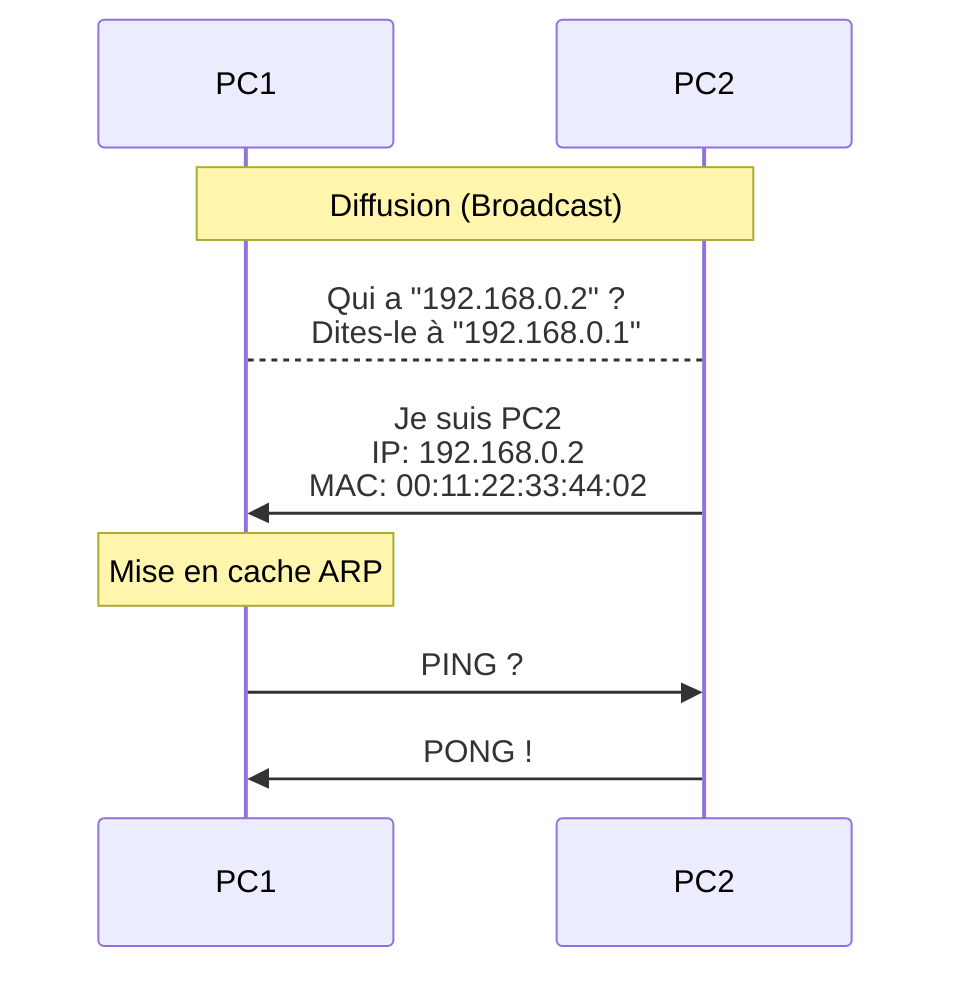

# Qu'est ce qu'une addresse IP ?
### IP v4

Une adresse IP (Internet Protocol) est un numéro d'identification unique attribué de façon permanente ou provisoire à chaque périphérique faisant partie d'un même réseau informatique utilisant l'Internet Protocol

 

255.255.255.255

Adresse dite de Broadcast

127.0.0.0

Localhost

 
 
 
<a href="https://www.paessler.com/fr/it-explained/ip-address">
Pour aller plus Loin
</a>

 
<!-- Donc quelle est la plus grande addresse IP possible ?

-->
---
transition: fade-out
hideInToc: true
---

## IP Privée ou Publique

Certains plages d'IP sont, par convention, dites "privées" ou "internes".

 

Bloc Privé 1

10.0.0.0/8

Bloc Privé 2

172.16.0.0/12

Bloc Privé 3

192.168.0.0/16

 
 

## Masques de sous-réseau

Une seule et même adresse IP identifie à la fois le réseau et une interface unique sur celui-ci

 Le masque de sous-réseau, détermine l’endroit auquel la partie d’une adresse correspondant au réseau se termine, et donc l’endroit où la portion correspond à l’hôte commence.
 

Adresse IP

192.168.1.1/24

Adresse de l'hôte

192.168.1.1

Masque de réseau

11111111 11111111 11111111 00000000

255. &nbsp;&nbsp;&nbsp;&nbsp;&nbsp;&nbsp;&nbsp;&nbsp; 255. &nbsp;&nbsp;&nbsp;&nbsp;&nbsp;&nbsp;&nbsp;&nbsp; 255.&nbsp;&nbsp;&nbsp;&nbsp;&nbsp;&nbsp;&nbsp;&nbsp; 0

  

Adresse du réseau

192. 168. 1. 0

  
  

<!-- Exemple dans l'adresse suivante, on indique à la fois le réseau, mais également l'hôte concerné. Cela permet de router vers le bon réseau, puis vers le bon hôte.-->

---
transition: fade-out
hideInToc: true
---
# Calcul de l'adresse du réseau

Adresse IP

192.168.1.1/24

Masque de réseau

255. 255. 255. 0

 
 

Adresse du réseau

192. 168. 1. 0

---
transition: fade-out
hideInToc: true
---

# Pourquoi des IP v6 ?

Une adresse IP comporte 32 bits, ce qui permet de créer jusqu'à 4 milliards de numéros.

4 294 967 296 = $2^{32}$

**Les amélioration d'IPv6 :**
- Routage plus efficace sans fragmentation des paquets
- Qualité de service (QoS) intégrée qui identifie les paquets prioritaires
- Sécurité de couche réseau intégrée (IPsec)
- Structure d'en-tête améliorée et réduction du coût de traitement

 

Pour aller plus Loin :

- [Epuisement des adresses IPv4](https://fr.wikipedia.org/wiki/%C3%89puisement_des_adresses_IPv4)
- [Différence entre IPv4 et IPv6 (Juniper)](https://www.juniper.net/fr/fr/research-topics/what-is-ipv4-vs-ipv6.html)

<!--
Combien d'humains sur Terre ? 
Concept de NAT, double NAT, triple NAT-->

---
transition: fade-out
hideInToc: true
---
# IPv4 vs IPv6

La taille des adresses passe de 32 bits en IPv4 à 128 bits en IPv6.

Adresse IP v4

192.168.1.1/24

Adresse IP v6

2DAB:FFFF:0000:3EAE:01AA:00FF:DD72:2C4A

<!--
en IPv6 soit on compte en binaire. Soit on utilise la base 16 et donc l'hexadécimal pour permettre l'écriture.
Tout ce qui compte, c'est la valeur binaire. 

Mais si on écrivait en binaire, combien de blocs faudrait-il ?
-->

---
transition: fade-out
hideInToc: true
---

# Le protocole ARP
### Comment faire le lien entre une adresse IP (=adresse Internet) et une adresse physique (=mac)

Address Resolution Protocol : Le protocole ARP peut être vu comme la mise en annuaire des correspondances MAC/IP

 

**Fonctionnement :** 

<ul>
  <li> Le routeur reçoit une trame provenant d’un équipement connecté à un des réseaux auquel il est lui-même rattaché.</li>
  <li> Les datagrammes sont transmis à la couche IP.</li>
  <li> Le routeur vérifie l’entête du datagramme.</li>
  <li> Si l’adresse IP fait partie des réseaux connus auquel le routeur est rattaché, l’information peut être envoyée à la couche APPLICATION, après que l’entête ait été désencapsulée. Dans le cas contraire, le routeur consulte sa table de routage, à la recherche d’un chemin à emprunter pour délivrer l’information.</li>
  <li> Le datagramme est ensuite envoyé via la carte réseau reliée au réseau sur lequel le routeur a décidé de l’envoyer.</li>
</ul>

 

---
transition: fade-out
hideInToc: true
---

# Table de routage et requête ARP

La table de routage est une table de correspondance entre l’adresse de la machine destinatrice et le nœud suivant auquel le routeur doit délivrer le message.

 

<a  href="https://www.it-connect.fr/chapitres/a-la-decouverte-de-ladresse-ethernet-et-darp/">
Pour aller plus Loin
</a>

---
transition: fade-out
hideInToc: true
---

# Exemple de requête ARP 

<a  href="https://cours.rihan.fr/docs/reseau/protocole-arp/">
Source
</a>

<!--
Vous verrez en TP ensuite en détails, comment ça fonctionne, notamment quand on ne sait pas ou envoyer où envoyer un paquet.
-->

