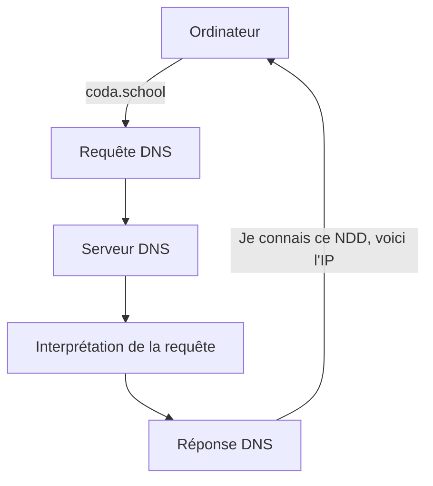
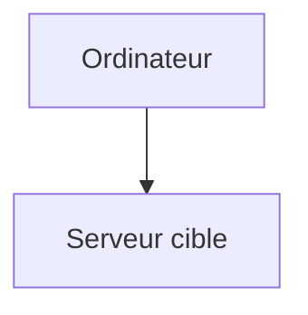
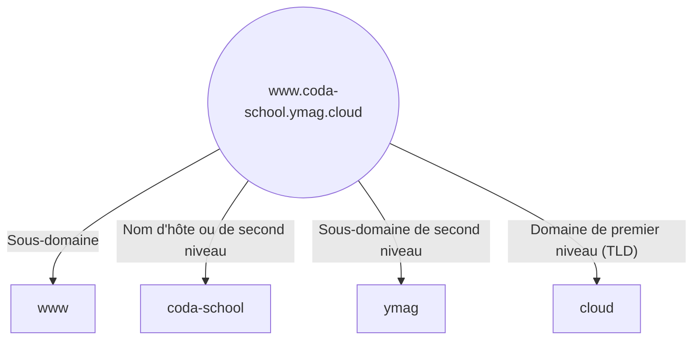

# Gérer son domaine avec un DNS

Le DNS (Domain Name System) est un service distribué qui associe un nom de domaine à une adresse IP

  

  Ex: Lorsqu'on tape coda.school, on fait appel à 1 serveur DNS
  Ce serveur va alors nous répondre en indiquant l'IP du serveur auquel on cherche à accéder. Notre ordinateur va donc ensuite pouvoir faire la requête directement à 
  

  

  
l'IP demandé.

  

<!-- 

Sur votre navigateur Internet, vous tapez google.com : vous n'avez pas de besoin de connaitre l'IP du serveur qui va vous répondre.
Pensez annuaire / répertoire
-->

---
transition: fade-out
hideInToc: true
---

# Hiérarchie du DNS

 

Les notions à retenir : Racine, top-level domain, domaine, sous-domaine

Le nom est résolu de droite à gauche, en partant de la racine

<!-- 
Exemple de hiérarchie de DNS 
-->

---
transition: fade-out
hideInToc: true
---

# Comment acheter un nom de domaine ?

Vous aurez probablement besoin à un moment d'acheter et de gérer un nom de Domaine. (Gérer les A-Record, C-Name, etc.)

Parmis les fournisseurs connus en France pour les noms de domaines, on trouve : 
- Gandi
- OVH
- GoDaddy

<!-- 
de 10€ par an (voire gratuit) à beaucoup (plusieurs milliers d'euros annuels)
-->